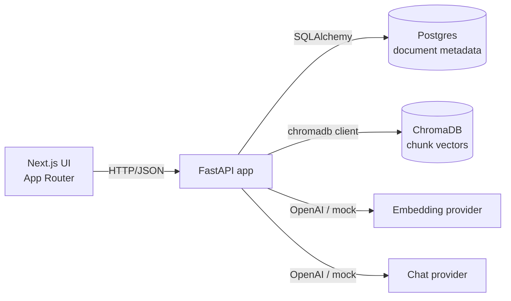

# RAG Knowledge Base Assistant

A full-stack Retrieval-Augmented Generation application. Upload company
documents (PDF, Markdown, plain text), ask questions in chat, and get
answers grounded in your own knowledge base — with numbered source
citations that link back to the exact passages used.

The stack runs end-to-end **without an API key** thanks to a built-in mock
LLM provider. Set `USE_MOCK_AI=false` and provide an `OPENAI_API_KEY` to
switch to OpenAI for real model answers; nothing else changes.

<p>
  
  
  
  
  
  
  
</p>

---

## Screenshots

Captures live in `docs/screenshots/` — drop new ones in and the tables below
update automatically. See `docs/screenshots/README.md` for the capture flow.

| Dashboard | Chat with citations |
| --- | --- |
|  |  |

| Documents | Dark mode |
| --- | --- |
|  |  |

---

## Why this project

Plain LLMs hallucinate. The hard part of building an internal assistant
isn't generating fluent text — it's grounding answers in your own data so
they're auditable and trustworthy. RAG is the architecture that makes that
work, and this repo is a full implementation of the pipeline plus a SaaS
dashboard around it.

What's covered end-to-end:

- **Ingestion** — file upload, text extraction (PDF / MD / TXT), word-window
  chunking with configurable overlap.
- **Indexing** — embeddings + vector store (ChromaDB) with deterministic
  ids and metadata so deletions and resets stay consistent.
- **Retrieval** — top-k cosine similarity, scores normalized to `[0, 1]`.
- **Generation** — citation-aware prompting; answers reference the chunks
  they used as `[1]`, `[2]`.
- **Surface** — sidebar dashboard with light/dark mode, drag-and-drop upload,
  chat with a live source-citation panel.

Mock mode is a deliberate design choice: retrieval, citations, and the
UI all work without external dependencies, so the project clones cleanly
and runs with a single command.

---

## Technical highlights

| Area | What's done | Why it matters |
| --- | --- | --- |
| Architecture | Layered backend: thin routes, service layer, repository layer, provider layer. DI wired through `api/deps.py`. | Routes never touch SQLAlchemy or Chroma — the same services are reusable in tests, scripts, and future workers. |
| Provider abstraction | `EmbeddingProvider` and `ChatProvider` are ABCs with `Mock` and `OpenAI` implementations, selected by config at request time. | Swapping providers is one env var, not a code change. |
| Error contract | Every exception is mapped to a typed `{error: {code, message, details}}` body via a single FastAPI exception handler. | Frontend can branch on `error.code`. No 500s leak stack traces. |
| Observability | `structlog` plus a `RequestContextMiddleware` that stamps every log line with a request id, method, path, status, and duration. The id is returned in `X-Request-ID`. | Logs correlate to a single request without a tracing dependency. |
| Testing | Pytest fixtures swap Postgres for SQLite and Chroma for a fresh tmp dir per test. The suite covers routes, services in isolation (with stubs), retrieval integration, chunking, embedding, and request validation. | The whole suite runs in CI with zero external services. |
| Frontend | shadcn/ui primitives, lucide icons, Tailwind tokens for light + dark via CSS variables, shimmer skeletons, toast feedback, source-citation cards with similarity bars, inline `[N]` citation pills in answers. | Looks like a product, not a prototype. |
| Mock embeddings | Deterministic SHA-1-hashed bag-of-words to 384-dim, L2-normalized. Cosine similarity still ranks semantically related text above unrelated text (covered by tests). | The mock isn't a placeholder — it preserves enough signal for the citation panel to feel real. |

---

## Architecture



Three deployable units — frontend, backend, data services — orchestrated
with `docker compose`. The backend owns the API contract; the frontend is
a thin client.

```
backend/app/
  core/           settings, logging, error envelope, request-id middleware
  api/routes/     thin HTTP adapters (documents, chat, health)
  api/deps.py     dependency wiring (services constructed here)
  schemas/        Pydantic request/response models
  models/         SQLAlchemy ORM
  repositories/   DB access only (no business rules)
  services/       business logic: ingestion, chunking, embedding,
                  retrieval, RAG orchestration, document lifecycle
  db/             engine, session, declarative base
```

Sequence diagrams for the upload and chat flows, plus the design
trade-offs and a "what would change at scale" note, are in
[`docs/architecture.md`](docs/architecture.md).

---

## Demo flow

```bash
# 1. Boot the stack.
cp .env.example .env
docker compose up --build

# 2. In a second terminal — seed the knowledge base with three sample docs.
bash scripts/seed.sh
```

Then in the browser:

1. **Dashboard** (http://localhost:3000) — KPI cards populate with document
   count, chunk count, indexed size, and last activity. The upload area is
   on the same screen for quick ingestion.
2. **Documents** — every seeded file with status, chunk count, size, and a
   row action menu. Delete one to see the optimistic update; the "Reset
   knowledge base" button opens a confirm dialog.
3. **Chat** — try one of the suggested questions:
   - *What are the pricing tiers and what does each include?*
   - *How does the runbook escalate severity 1 issues?*
   - *What's the company policy on remote work?*
4. **Inspect citations** — the right-hand panel shows each retrieved chunk
   with a similarity bar, chunk index, and source filename. Answers render
   `[1]`, `[2]` as inline citation pills.
5. **Toggle dark mode** — top right; CSS variables flip cleanly.
6. **Flip to a live model** *(optional)* — stop the backend, set
   `USE_MOCK_AI=false` and `OPENAI_API_KEY=…` in `backend/.env`, restart.
   The sidebar badge swaps Mock to Live and answers come from the model.

---

## Local setup

### Option A — Docker (recommended)

```bash
cp .env.example .env             # tweak ports if needed
docker compose up --build
```

| Service   | URL                              |
| --------- | -------------------------------- |
| Frontend  | http://localhost:3000            |
| Backend   | http://localhost:8000            |
| API docs  | http://localhost:8000/docs       |
| Postgres  | localhost:5432                   |

### Option B — Run services manually

Requires Python 3.12 and Node 20+.

```bash
# 1. Postgres (or set DATABASE_URL=sqlite:///./dev.db in backend/.env)
docker run --name rag-postgres -p 5432:5432 \
  -e POSTGRES_USER=rag -e POSTGRES_PASSWORD=rag -e POSTGRES_DB=rag_knowledge_base \
  -d postgres:16-alpine

# 2. Backend
cd backend
cp .env.example .env
python3.12 -m venv .venv && source .venv/bin/activate
pip install -r requirements.txt
uvicorn app.main:app --reload --port 8000

# 3. Frontend (new terminal)
cd frontend
cp .env.example .env.local
npm install
npm run dev
```

---

## API overview

All endpoints are documented interactively at http://localhost:8000/docs
(OpenAPI / Swagger) and http://localhost:8000/redoc.

| Method | Path                        | Description                                  |
| ------ | --------------------------- | -------------------------------------------- |
| GET    | `/health`                   | Health check + mock-mode indicator           |
| POST   | `/documents/upload`         | Multipart upload, ingests synchronously      |
| GET    | `/documents`                | List all documents                           |
| GET    | `/documents/{id}`           | Get a single document                        |
| DELETE | `/documents/{id}`           | Remove document + its embeddings             |
| POST   | `/documents/reset`          | Wipe all documents and embeddings            |
| POST   | `/chat`                     | Ask a question, get answer + citations       |

Every response carries an `X-Request-ID` header that matches the structured
log line for that request.

### `POST /chat` response

```json
{
  "answer": "ACME offers three pricing tiers: Starter, Growth, and Enterprise. [1]",
  "citations": [
    {
      "document_id": "9c8a…",
      "document_name": "acme-product-faq.md",
      "chunk_index": 0,
      "text": "ACME offers three pricing tiers …",
      "score": 0.83
    }
  ],
  "source_documents": ["acme-product-faq.md"],
  "confidence": 0.81,
  "used_mock": true
}
```

### Error envelope

```json
{
  "error": {
    "code": "ingestion_error",
    "message": "Unsupported file type '.png'.",
    "details": {}
  }
}
```

---

## Environment variables

Backend (`backend/.env`, template at `backend/.env.example`):

| Variable                 | Default                                | Description                                |
| ------------------------ | -------------------------------------- | ------------------------------------------ |
| `DATABASE_URL`           | `postgresql+psycopg2://rag:rag@…`      | SQLAlchemy URL                             |
| `CHROMA_PERSIST_DIR`     | `./chroma_data`                        | Chroma persistent storage                  |
| `CHROMA_COLLECTION`      | `rag_documents`                        | Collection name                            |
| `UPLOAD_DIR`             | `./uploads`                            | Where uploaded files are stored on disk    |
| `MAX_UPLOAD_MB`          | `25`                                   | Per-file upload limit                      |
| `CHUNK_SIZE`             | `800`                                  | Chunk size (words)                         |
| `CHUNK_OVERLAP`          | `120`                                  | Overlap between chunks                     |
| `TOP_K`                  | `4`                                    | Retrieved chunks per query                 |
| `USE_MOCK_AI`            | `true`                                 | Use mocks when true (or when no key set)   |
| `OPENAI_API_KEY`         | *empty*                                | Required when `USE_MOCK_AI=false`          |
| `OPENAI_EMBEDDING_MODEL` | `text-embedding-3-small`               |                                            |
| `OPENAI_CHAT_MODEL`      | `gpt-4o-mini`                          |                                            |
| `LOG_LEVEL`              | `INFO`                                 | structlog level                            |
| `CORS_ORIGINS`           | `http://localhost:3000`                | Comma-separated list                       |

Frontend reads `NEXT_PUBLIC_API_BASE_URL` (default `http://localhost:8000`).

---

## Tests

Backend tests use SQLite and a fresh Chroma tmp dir per test — no external
services required.

```bash
cd backend
pytest -q
```

Frontend tests (vitest + testing-library):

```bash
cd frontend
npm test
```

GitHub Actions runs the backend suite on every push and PR
(`.github/workflows/backend-tests.yml`).

---

## Project structure

```
rag-knowledge-base-assistant/
├── backend/                 FastAPI service
│   ├── app/
│   │   ├── api/
│   │   │   ├── deps.py            DI wiring
│   │   │   └── routes/            documents, chat, health
│   │   ├── core/                  config, logging, errors, middleware
│   │   ├── db/                    engine, session, base
│   │   ├── models/                SQLAlchemy ORM
│   │   ├── repositories/          DB access
│   │   ├── schemas/               Pydantic schemas
│   │   ├── services/              chunking, embedding, retrieval, RAG, …
│   │   └── main.py                FastAPI factory + lifespan
│   ├── tests/                     pytest suite
│   ├── Dockerfile
│   └── requirements.txt
├── frontend/                Next.js 15 App Router
│   ├── app/                       Dashboard, Documents, Chat pages
│   ├── components/                ui/ (shadcn), layout/, chat/, documents/
│   ├── hooks/
│   ├── lib/                       api client, types, utils
│   ├── tests/
│   └── Dockerfile
├── sample-documents/        Seed content (ACME FAQ, handbook, runbook)
├── scripts/seed.sh          Upload sample docs via /documents/upload
├── docs/architecture.md     Sequence diagrams + trade-offs
├── docker-compose.yml
└── .github/workflows/backend-tests.yml
```

---

## Future improvements

Out of scope for v1 but the natural next steps:

- Async ingestion with a job queue (Celery / RQ / SQS) and a
  `processing → ready` websocket update for the UI
- Streaming chat responses over Server-Sent Events
- Hybrid retrieval (BM25 + vector) plus a cross-encoder reranker
- Authentication and multi-tenant workspaces
- Alembic migrations in place of `create_all`
- OpenTelemetry tracing and Prometheus metrics
- Document versioning and automatic re-ingestion when chunking
  parameters change
- More providers (Anthropic, Azure OpenAI, local Ollama)

---

## License

MIT — see [`LICENSE`](LICENSE). Built in 2025 as a portfolio project.
