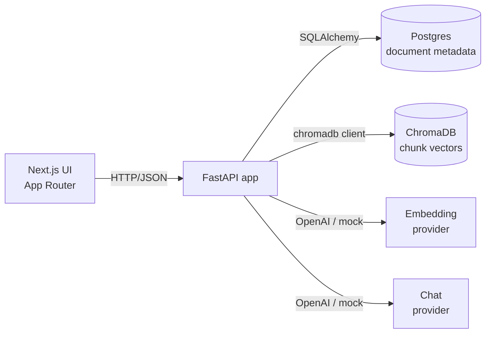
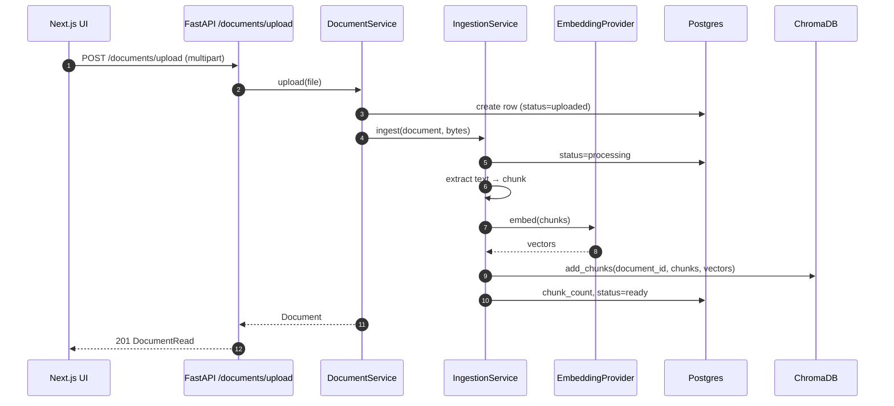
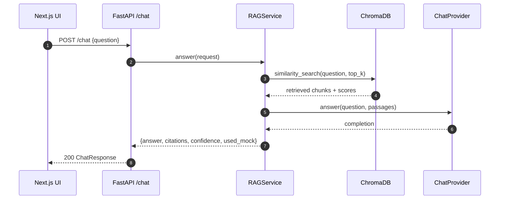

# Architecture

## High-level



The application is split into three deployable units — frontend, backend, and
data services — all orchestrated with `docker compose`. The backend is the
single source of truth for the API contract; the frontend is a thin client.

## Backend layering

The backend deliberately uses a clean layered architecture so the business
logic can evolve without rewriting the API surface or storage layer.

```
api/routes           ← thin HTTP adapters
  └── api/deps.py    ← dependency wiring (the only place services are built)
        └── services ← business logic, provider orchestration
              ├── repositories ← DB access only
              └── providers    ← embedding + chat (mock or OpenAI)
                    └── db/    ← engine, session, base model
```

- **Routes** parse and validate requests, call a service, and return a Pydantic
  schema. They never touch SQLAlchemy or vector stores directly.
- **`api/deps.py`** is the single point of dependency construction. Each
  service has one `Depends(...)` function; routes compose them rather than
  re-wiring graphs per file.
- **Services** own business rules: upload validation, ingestion pipeline,
  retrieval, RAG orchestration, confidence scoring.
- **Repositories** are the only place that constructs SQL queries.
- **Providers** abstract over external dependencies. Each has a mock
  implementation, which is what makes the whole stack runnable without keys.

## Cross-cutting concerns

- **`RequestContextMiddleware`** stamps every request with a UUID, binds
  it to the structlog context, and returns it in the `X-Request-ID`
  response header. Every log line for that request carries the id, so
  failures can be traced back from the client.
- **Error envelope** — all exceptions (typed `AppError`, FastAPI
  validation errors, and unexpected exceptions) flow through one handler in
  `app.core.errors`. The response body is always
  `{ "error": { "code", "message", "details" } }`.
- **Lifespan** — startup work (directory creation, `Base.metadata.create_all`)
  runs in the FastAPI lifespan context manager (the modern replacement for
  `@app.on_event("startup")`).

## Request flow: document upload



## Request flow: chat



## Data model

Only one persistent table: `documents`. ChromaDB owns the chunk storage. The
two are kept in sync by `DocumentService.delete` and `DocumentService.reset`,
which always operate on both.

| Column         | Type         | Notes                                 |
| -------------- | ------------ | ------------------------------------- |
| id             | uuid (str)   | primary key                           |
| filename       | str          | original upload name                  |
| content_type   | str          | mime type at upload time              |
| size_bytes     | int          |                                       |
| status         | enum         | uploaded / processing / ready / failed|
| chunk_count    | int          | populated after ingestion             |
| error_message  | text \| null | populated on failure                  |
| created_at     | timestamptz  |                                       |
| updated_at     | timestamptz  |                                       |

Each Chroma chunk stores its embedding plus metadata `{document_id,
document_name, chunk_index}` so citations can be reconstructed without
a Postgres lookup.

## Provider abstraction

Embedding and chat are both abstract base classes with two implementations:

- `MockEmbeddingProvider` — deterministic 384-dim bag-of-words hash, L2-normed.
  Similar wording shares buckets so cosine similarity still ranks meaningfully.
- `OpenAIEmbeddingProvider` — wraps `openai.embeddings.create`.
- `MockChatProvider` — extractive: stitches together the leading sentences of
  the top-k retrieved chunks and tags `[1]`, `[2]` citations.
- `OpenAIChatProvider` — wraps `openai.chat.completions.create` with a
  conservative temperature.

The factory functions (`get_embedding_provider`, `get_chat_provider`) inspect
settings and return the mock implementation when `USE_MOCK_AI=true` or when no
API key is present. Switching providers is one env var.

## Mock mode

The mock providers are functional, not stubs:

- Mock embeddings preserve enough signal that retrieval ranks more relevant
  chunks higher than unrelated ones (covered by `tests/test_embedding_mock.py`).
- Mock chat answers are flagged in the response (`used_mock: true`) and the
  citation panel still works — retrieval is what populates it.

The result: `docker compose up` is enough to use the product. Only the final
answer text changes when you switch to a real provider.

## Trade-offs and what would change at scale

The current implementation prioritizes clarity and zero-friction setup over
production hardening. At scale you'd want:

- **Async ingestion** — currently `POST /documents/upload` blocks until
  embedding finishes. A queue (Celery, RQ, SQS) would let the API return
  immediately with a `processing` status.
- **Streaming chat** — `/chat` returns a single JSON blob. SSE or chunked
  responses would improve perceived latency.
- **Hybrid retrieval** — vector-only similarity misses exact-match cases (IDs,
  acronyms). BM25 + a learned reranker (e.g. Cohere Rerank or a cross-encoder)
  is the standard upgrade.
- **Migrations** — `create_all` is used at startup for zero-friction. Alembic
  is the obvious next step once the schema starts evolving.
- **Observability** — structured logs are in place; OpenTelemetry tracing and
  Prometheus metrics would be the next layer.
- **Multi-tenancy & auth** — there is none. A workspace-scoped data model and
  authenticated routes would be required for shared deployments.
